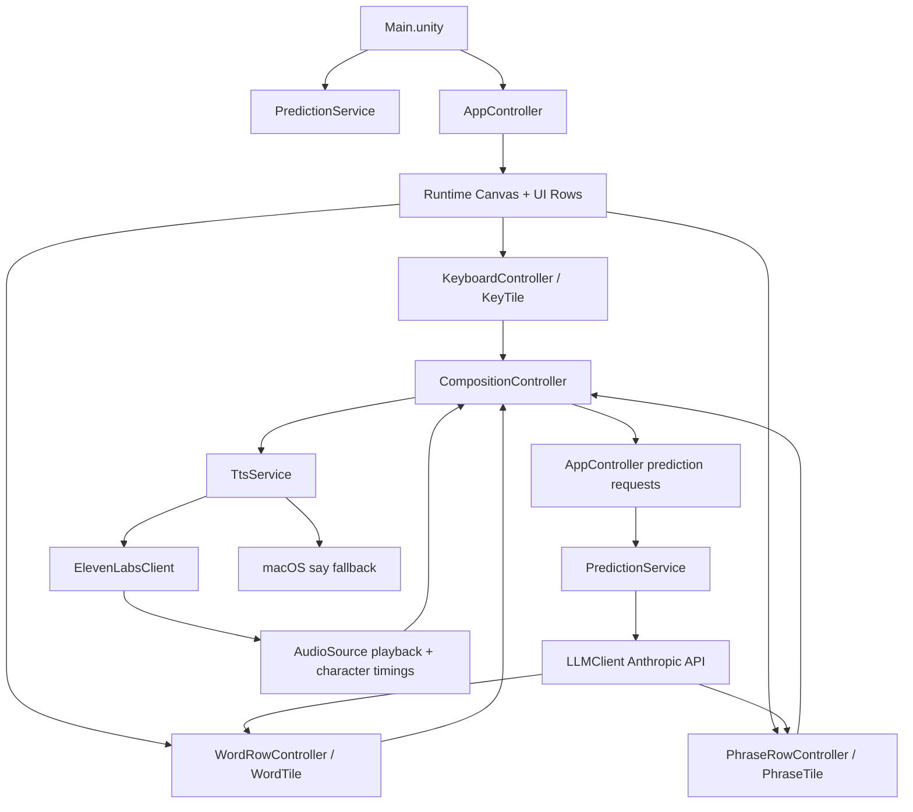

# BCIKeyboardXR - Manager Deliverable Report

## Executive Summary

BCIKeyboardXR is a Unity 6 LTS desktop prototype for a BCI-inspired AAC keyboard. It demonstrates a full communication loop:

1. Mouse hover-dwell stands in for gaze plus SSVEP confirmation.
2. A runtime-built glass UI presents phrase predictions, word completions, a QWERTY keyboard, and a composition bar.
3. Anthropic-powered predictions personalize suggestions using a Sarah Martinez ALS user profile.
4. Speak uses ElevenLabs TTS with character-level timestamps and animates a synchronized wave-through highlight in the composition bar.
5. If ElevenLabs is unavailable, the system falls back to macOS `/usr/bin/say`.

Current branch: `feature/elevenlabs-tts`.

## Cleanup Completed

| Item | Action | Rationale |
|---|---|---|
| `Assembly-CSharp.csproj.lscache` | Removed | Generated IDE/cache artifact, not useful to the final Unity build. |
| `DIAGNOSTIC_REPORT.md` | Deleted | Earlier internal diagnostic file contained stale debugging notes and obsolete TODO/log references. |
| `BACKEND_README.md` | Rewritten | Removed old `BackendSmokeTest.cs` instructions. The runtime now verifies backend behavior through `Main.unity`. |

## Runtime Flow

## Process Ownership Map

| Process | What Happens | Primary Files |
|---|---|---|
| Scene boot | `Main.unity` contains `PredictionService` and `AppController`. `AppController` builds the Canvas, top bar, phrase grid, word row, composition bar, keyboard, and EventSystem at runtime. | `Assets/Scenes/Main.unity`, `Assets/Scripts/UI/AppController.cs` |
| User profile load | Sarah Martinez profile is loaded from Resources and cached for prompt injection. | `Assets/Scripts/Core/UserProfile.cs`, `Assets/Resources/user_profile.md` |
| Config load | Anthropic key is required; ElevenLabs key is optional. Missing ElevenLabs key triggers TTS fallback only. | `Assets/Scripts/LLM/ConfigLoader.cs`, local ignored `Assets/Resources/config.json` |
| Keyboard input | Keys are generated in QWERTY rows with punctuation, Backspace, Space, and Enter. Each key uses dwell selection and a unique flicker frequency. | `KeyboardController.cs`, `KeyTile.cs`, `DwellSelectable.cs`, `FlickerTile.cs` |
| Word prediction | Letters update composition text and trigger debounced word prediction. Word tiles update from Anthropic results. | `AppController.cs`, `PredictionService.cs`, `LLMClient.cs`, `WordRowController.cs`, `WordTile.cs` |
| Phrase prediction | Completed context is stripped of partial words before phrase prediction, avoiding duplicate phrase commits. | `AppController.cs`, `PredictionService.cs`, `LLMClient.cs`, `PhraseRowController.cs`, `PhraseTile.cs` |
| Composition state | Tracks committed text, ghost previews, cursor, smart backspace, reset, commit pulse, and TTS wave animation. | `CompositionController.cs`, `GhostPreviewHelper.cs` |
| Dwell selection | Pointer hover fills a radial/halo progress indicator and fires selected events after dwell duration. | `DwellSelectable.cs`, tile classes |
| SSVEP-style flicker | Each tile has an independent sine-wave light overlay. Phrase tiles use 6.0-7.5 Hz, word tiles 8.0-10.5 Hz, keys 11+ Hz, action keys 15+ Hz. | `FlickerTile.cs`, `PhraseRowController.cs`, `WordRowController.cs`, `KeyboardController.cs`, tile classes |
| Visual styling | Runtime-generated rounded sprites, glass colors, halos, shadows, background texture, TMP font fallback, and layout helpers. | `UiTheme.cs`, `PremiumTileAnimator.cs` |
| Speak / TTS | Speak sends current text to ElevenLabs, receives MP3 plus character timings, plays through `AudioSource`, and emits character indices for synchronized wave highlighting. | `TtsService.cs`, `ElevenLabsClient.cs`, `CompositionController.cs`, `AppController.cs` |
| TTS fallback | If ElevenLabs key/API/decode fails, `/usr/bin/say -v Samantha` speaks the text. Character wave is skipped because fallback has no timing. | `TtsService.cs` |
| Reset | Composition fades down, clears text/rows, and refreshes phrase predictions. | `AppController.cs`, `CompositionController.cs` |

## File-by-File Audit

### Core

| File | Role | Essential | Notes |
|---|---|---:|---|
| `Assets/Scripts/Core/UserProfile.cs` | Loads/caches profile text and prompt section. | Yes | Required for personalized Anthropic prompts. |
| `Assets/Scripts/Core/TtsService.cs` | MonoBehaviour-backed TTS singleton; owns AudioSource, ElevenLabs playback, temp MP3 lifecycle, Stop, and `say` fallback. | Yes | New final Speak implementation. |
| `Assets/Scripts/Core/*.meta` | Unity GUID metadata. | Yes | Keep paired with scripts. |

### LLM / API

| File | Role | Essential | Notes |
|---|---|---:|---|
| `Assets/Scripts/LLM/ConfigLoader.cs` | Loads Anthropic and ElevenLabs API keys from local config. | Yes | Anthropic missing still fails loudly; ElevenLabs missing falls back gracefully. |
| `Assets/Scripts/LLM/LLMClient.cs` | Anthropic Messages API client for word/phrase prediction. | Yes | Uses UnityWebRequest and Newtonsoft parsing. |
| `Assets/Scripts/LLM/PredictionService.cs` | Singleton service for debounced/cached predictions and main-thread callbacks. | Yes | Main bridge between UI and LLM client. |
| `Assets/Scripts/LLM/PredictionTypes.cs` | DTOs for word and phrase responses. | Yes | Lightweight result contracts. |
| `Assets/Scripts/LLM/ElevenLabsClient.cs` | ElevenLabs with-timestamps client. | Yes | Returns MP3 bytes plus character timings. |
| `Assets/Scripts/LLM/*.meta` | Unity GUID metadata. | Yes | Keep paired with scripts. |

### UI

| File | Role | Essential | Notes |
|---|---|---:|---|
| `Assets/Scripts/UI/AppController.cs` | Central orchestrator and runtime UI builder. | Yes | Wires prediction, keyboard, composition, buttons, and TTS. |
| `Assets/Scripts/UI/CompositionController.cs` | Text state, ghost preview, smart backspace, pulses, reset, TMP wave-through animation. | Yes | Owns the visible sentence and spoken-character highlight. |
| `Assets/Scripts/UI/KeyboardController.cs` | Builds keyboard layout and assigns key flicker frequencies. | Yes | Layout is runtime-generated. |
| `Assets/Scripts/UI/KeyTile.cs` | Individual keyboard tile visual and dwell behavior. | Yes | Standard/action variants. |
| `Assets/Scripts/UI/WordRowController.cs` | Manages six word-completion tiles. | Yes | Updates/clears predictions. |
| `Assets/Scripts/UI/WordTile.cs` | Individual word prediction tile. | Yes | Hover preview, dwell commit, flicker, animation. |
| `Assets/Scripts/UI/PhraseRowController.cs` | Manages four phrase prediction tiles. | Yes | 2x2 phrase grid. |
| `Assets/Scripts/UI/PhraseTile.cs` | Individual phrase tile. | Yes | Hover preview, dwell commit, flicker, animation. |
| `Assets/Scripts/UI/DwellSelectable.cs` | Reusable hover-dwell selector. | Yes | Input abstraction for gaze/SSVEP stand-in. |
| `Assets/Scripts/UI/FlickerTile.cs` | Sine-wave tile light modulation. | Yes | Produces visible independent flicker. |
| `Assets/Scripts/UI/PremiumTileAnimator.cs` | Hover lift, selection punch/flash, fly-label animation. | Yes | Coroutine-based, no DOTween dependency. |
| `Assets/Scripts/UI/GhostPreviewHelper.cs` | Pure preview helpers. | Yes | Keeps AppController preview logic small. |
| `Assets/Scripts/UI/UiTheme.cs` | Runtime theme and generated sprite/texture factory. | Yes | Avoids custom shaders/assets for glass UI. |
| `Assets/Scripts/UI/*.meta` | Unity GUID metadata. | Yes | Keep paired with scripts. |

### Scene, Prefabs, Resources

| File/Group | Role | Essential | Notes |
|---|---|---:|---|
| `Assets/Scenes/Main.unity` | Main runnable scene. | Yes | Contains camera, PredictionService, AppController. |
| `Assets/Prefabs/*.prefab` | Script-root tile prefabs. | Yes | Visual children are built by scripts in Awake/Start. |
| `Assets/Resources/user_profile.md` | Demo user profile. | Yes | Conditions LLM predictions. |
| `Assets/Resources/config.json` | Local secret config. | Local only | Must not be committed. Required for live API use. |
| `Assets/InputSystem_Actions.inputactions` | Unity input actions. | Useful | Supports EventSystem/input module workflow. |
| `Assets/TextMesh Pro/**` | TMP essentials, fonts, shaders, settings. | Yes | Needed for all UI text and composition wave. |
| `Assets/Settings/**` | URP, renderer, build profile, template settings. | Yes | Keep for Unity project integrity. |
| `ProjectSettings/**` | Unity project/player/editor settings. | Yes | Required for reproducible Unity open/build. |
| `Packages/manifest.json` | Package dependency manifest. | Yes | Includes Newtonsoft, TMP, UGUI, Input System, URP. |
| `Packages/packages-lock.json` | Resolved package lock. | Yes | Keeps package versions stable. |

### Documentation

| File | Role | Keep? | Notes |
|---|---|---:|---|
| `HANDOFF.md` | Live project state and handoff. | Yes | Updated to include TTS and current branch. |
| `UI_NOTES.md` | How to run and walkthrough. | Yes | Includes ElevenLabs/say behavior. |
| `BACKEND_README.md` | Backend/TTS setup and verification. | Yes | Updated to remove obsolete smoke-test instructions. |
| `BACKEND_PLAN.md` | Original backend architecture. | Yes | Useful design history. |
| `COUNCIL_BRIEF.md` | ElevenLabs TTS architecture review. | Yes | Manager can see risk review and mitigations. |
| `VISIONOS_AESTHETIC_RESEARCH.md` | Visual design rationale. | Yes | Explains fake-glass/visionOS aesthetic choices. |
| `DIAGNOSTIC_REPORT.md` | Old internal diagnostic report. | No | Removed during cleanup. |

## External Dependencies

| Dependency | Used For | File(s) |
|---|---|---|
| Anthropic Messages API | Word and phrase predictions. | `LLMClient.cs`, `PredictionService.cs` |
| ElevenLabs with-timestamps API | Speech synthesis plus character timings. | `ElevenLabsClient.cs`, `TtsService.cs` |
| macOS `/usr/bin/say` | Offline TTS fallback. | `TtsService.cs` |
| Newtonsoft.Json | API JSON request/response parsing. | `LLMClient.cs`, `ElevenLabsClient.cs` |
| Unity UGUI + TextMeshPro | Runtime interface and text rendering. | UI scripts, TMP assets |
| Unity Input System | Pointer hover/click/dwell events. | `AppController.cs`, scene/EventSystem |

## Verification Checklist

| Check | Expected Result |
|---|---|
| Open `Assets/Scenes/Main.unity` and press Play | Canvas builds with phrase grid, composition bar, keyboard, and buttons. |
| Type a letter | Word predictions update from Anthropic. |
| Hover/dwell a key or tile | Tile lifts, dwell halo fills, selection fires. |
| Observe keys/tiles at rest | Flicker overlays pulse independently. |
| Commit a word | Word is appended, word row refreshes, phrase predictions refresh. |
| Commit a phrase | Partial word is stripped, continuation appends cleanly. |
| Press Speak with valid ElevenLabs key | ElevenLabs audio plays and characters wave through composition text. |
| Press Speak with missing/invalid ElevenLabs key | macOS `say` fallback speaks without wave animation. |
| Press Stop during speech | Audio stops, button returns to Speak, character waves reset. |
| Press Reset | Composition and rows clear; fresh phrase predictions load. |

## Remaining Delivery Notes

- Do not commit `Assets/Resources/config.json`.
- ElevenLabs API keys must be valid for wave-through TTS to run; invalid keys correctly fall back to `say`.
- Current UI is tuned for 1920x1080 desktop play mode and standalone macOS.
- This is a prototype: no physical eye tracker, XR ray, or SSVEP classifier is implemented. Mouse hover and visual flicker demonstrate the intended interaction model.
